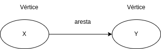

# Capítulo 6 - Pesquisa em largura

No capítulo em questão é introduzido o conceito de grafos e a pesquisa em largura.

## Grafos
Um grafo é um conjunto de conexões de objetos. Os objetos são chamados de vértices e as conexões são chamadas de arestas. Um vértice por está conectado a outro vértice por uma aresta. Quando os vértices estão conectados por uma aresta, diz-se que eles são vizinhos.

Os grafos são uma maneira de modelar como eventos diferentes estão conectados entre si.

## Pesquisa em largura
A pesquisa em largura é um algoritmo para percorrer ou pesquisar em um grafo. O algoritmo começa em um vértice inicial e explora todos os seus vizinhos. Então, para cada um desses vizinhos, explora os seus vizinhos não explorados e assim por diante. O algoritmo é implementado usando uma fila.

Como o intuito é encontrar o caminho mais curto entre dois vértice, então usa-se a estrutura fila. Por exemplo, quero encontrar entre meus amigos um que saiba programar em Java, eu tenho 3 amigos(Maria, Ana e João). Assim, o algoritmo é o seguinte:
- Pergunto a Maria se ela sabe programa em Java. Se sim fim de algoritmo e se não eu enfileiro os amigos de Maria. 
- Pergunto a Ana se ela sabe programa em Java. Se sim fim de algoritmo e se não eu enfileiro os amigos de Ana.
- Pergunto a João se ele sabe programa em Java. Se sim fim de algoritmo e se não eu enfileiro os amigos de João.
- E assim por diante com os amigos dos meus amigos, pelo fato do uso de fila é encontrado o caminho mais curto entre os vértices.

Este algoritmo ajuda a responder a dois tipos de pergunta:
- 1: Existe algum caminho do vértice A até o vértice B?
- 2: Qual o caminho mínimo do vértice A até o vértice B?

### Fila
Uma fila é uma estrutura de dados que permite adicionar elementos e removê-los na ordem em que foram adicionados. A operação de adicionar um elemento é chamada de enfileirar e a operação de remover um elemento é chamada de desenfileirar.

A fila é uma estrutura de dados do tipo FIFO (First In, First Out), ou seja, o primeiro elemento a ser adicionado é o primeiro a ser removido.

### Pilha
Uma pilha é uma estrutura de dados que permite adicionar elementos e removê-los na ordem em que foram adicionados. A operação de adicionar um elemento é chamada de empilhar e a operação de remover um elemento é chamada de desempilhar.

A pilha é uma estrutura de dados do tipo LIFO (Last In, First Out), ou seja, o último elemento a ser adicionado é o primeiro a ser removido.

## Grafo direcionado e não direcionado
Um grafo direcionado é um grafo onde as arestas têm uma direção. Ou seja, a aresta que conecta o vértice A ao vértice B não é a mesma que conecta o vértice B ao vértice A.

Já um grafo não direcionado é um grafo onde as arestas não têm uma direção. Ou seja, a aresta que conecta o vértice A ao vértice B é a mesma que conecta o vértice B ao vértice A.

## Tempo de execução
O tempo de execução do algoritmo de pesquisa em largura é O(V + E), onde V é o número de vértices e E é o número de arestas. Ou seja, o tempo de execução é linear em relação ao número de vértices e arestas.

## Árvore de grafos
Uma árvore de grafos é um grafo que não tem ciclos. Ou seja, não é possível começar em um vértice e seguir as arestas do grafo e voltar para o vértice inicial.

Assim, as arestas de uma árvore de grafos apresentam uma hierarquia, onde um vértice é o pai de outro vértice. 